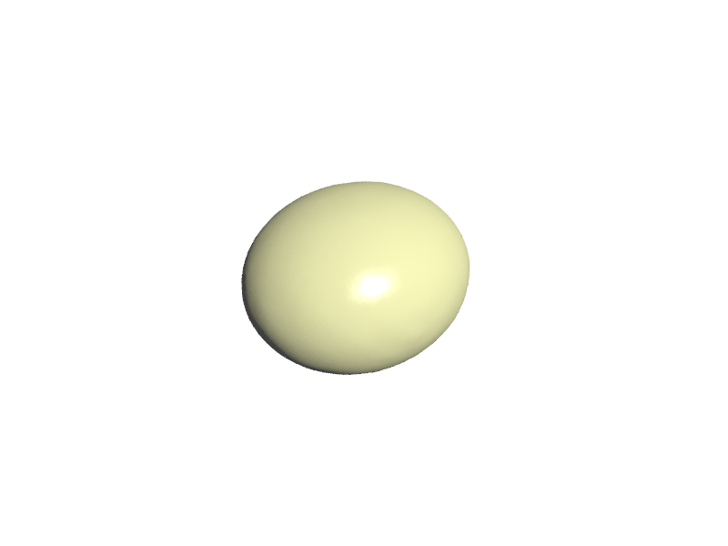
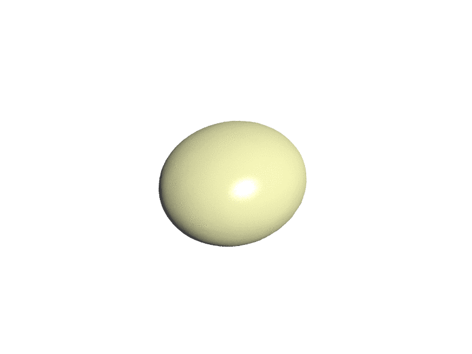

# BrainGrowth

## Table of Contents

- [Introduction](#introduction)
- [Requirements](#requirements)
- [Configuration of Parameters and Run](#run)

## Introduction

This repository contains the work during the PhD of Xiaoyu WANG, titled "Brain development analysis using MRI and physical modeling".

## Requirements

All scripts were coded in `python 2.7`, but we are working to be compatible to `python 3.7`.

<details>
<summary><b>Python packages and versions</b></summary>

- enum34==1.1.6
- funcsigs==1.0.2
- llvmlite==0.24.0
- nibabel==2.3.1
- numba==0.39.0
- numpy==1.16.2
- numpy-stl==2.10.1
- python-utils==2.3.0
- scikit-learn==0.20.3
- scipy==1.2.1
- singledispatch==3.4.0.3
- six==1.11.0
- Vapory==0.1.1
- mpmath==1.0.0
- os
</details>

The file called `requirements.txt` helps to install all the python libraries.

- Using pip:
```
pip install -r requirements.txt
```

- Using anaconda:
```
conda install --file requirements.txt
```

It is worth noting that the installation of these three libraries (numpy-stl, nibabel and Vapory) requires the use of pip. 

## Configuration of Parameters and Run

### simulation.py

Example of dynamic simulations of a neo-Hookean solid with a tangential differential growth.

```
python simulation.py '-i' './data/sphere5.mesh' '-o' './res/sphere5' '-t' 0.042 '-g' 1.829
```

**i**: path of input maillage

**o**: path of output

**t**: cortical thickness

**g**: relative growth rate

### Running a demo

In simulation.py, there are certain parameters should be set manually:

**a**: average mesh spacing

For sphere5.mesh:

**a** = 0.01

#### Input mesh image， output dynamic process

